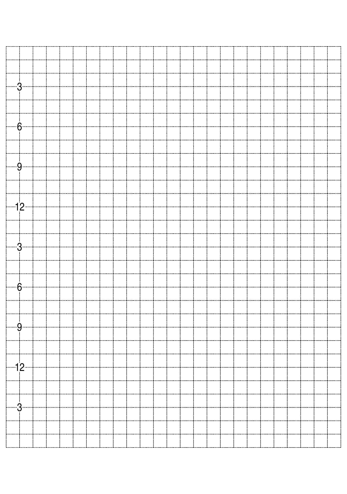

# Planner Maker

A tool for generating custom planners in various styles

## hopes and dreams

This project hopes to be a generator for custom planners. The dream is generation of a full year planner pdf which can then be easily printed. The pdf will include whatever sections (daily, weekly, monthly, etc.) the user wants, in whatever order they want, laid out how they want. There will be a web interface for the planner generator.

## implementation

I started with hand-coded PostScript of a daily timeline. I'm having a blast building the first bash script to implement settings from the `settings.md` files. I'm intending to do this whole project in bash (with POSIX commands) and PostScript to maximize portability. You can see the bash script progress in the `implement-timeline-builder-shell-script` branch.

## daily pages

the first two modules I will build will be the timeline and date modules, as
these are the ones I'm most excited about.

After I build both modules, I will move on to a "page orchestrator" script
which will combine the timeline and date module onto one page, according to the
settings set by the user.

### timeline

my ideal timeline will have 24 hours from 3am to 3am on a 12 hour clock,
probably with about 3.7mm-squared cells. I would like it to be landscape, so I
might have to lower the cell height. and I'd like periodically highlighted
intersections, so I can easily line up the cells with their corresponding time
at a glance.

I've implemented a lot of that so far. you can see what my priorities are
below.

here's an example of a timeline grid that the program can generate from user settings

### date

I would like my daily pages to have automatically calculated dates, so that
will be the next module I build. I'm excited to see how I can get bash (the
`date` command) and PostScript working together to make that happen.

## usage

To see an example you can open a `.ps` file with most pdf viewers. And then you can replace setting vars. At least until the bash scripts get implemented.

## a todo

- [ ] config
  - [ ] finalize config file implementation
    - [ ] easy and predictable to config and run locally
      - [ ] parser is reliable
      - [ ] config file is easy to read
      - [ ] config file is easy to modify
      - [ ] (bonus) config file is easy to read and modify by laypeople (is this silly?)
    - [ ] easy and predictable to config and run from web interface
- [ ] daily timeline
  - [ ] dates
    - [ ] this will probably have to be controlled externally, as I don't think PostScript is handy with dates, and I don't want to make a bespoke date module lol
  - [ ] timeline
    - [ ] grid
      - [x] alignment
        - [x] horizontal left/center/right
        - [x] vertical top/center/bottom
      - [ ] grid generation
        - [ ] **iron out grid generation. too many rando `1 add` etc on rows and columns**
        - [ ] handle grids which don't fit on page
          - [ ] margins too large
            - [ ] lower margin size. stop at lower limit (`left/bottom/etc-margin-minimum`)
          - [ ] too many columns (if margin is at lower limit)
            - [ ] cap column count to fit
          - [ ] too many rows (if margin is at lower limit)
            - [ ] lower cell height
            - [ ] lessen padding (if cell height is at bottom limit)
            - [ ] fewer hours (if padding is entirely removed)
        - [ ] alternate line styles
          - [ ] place $`n`$ lines maximally distant from each other, apply offset to move lines
        - [x] adjustable vertical padding
      - [ ] line generation
        - [ ] alternate line styles
          - [ ] start with styles to choose from; allow more customization later
        - [x] horizontal and vertical line generation
        - [ ] line styles more predictably controlled
        - [ ] cell generation
          - [ ] more predictable line-style control
          - [x] symmetric cell lines
            - [x] ensure cell line ends start with dash, rather than space
              - [x] adjustable with dash offset
              - [x] dashes create crosses at intersections
      - [ ] hobonichi style lines (dot on cell intersection, four dashes between dots)
    - [ ] hours
      - [x] a numbering implementation
        - [x] numbers in 12 and 24 hour formats
        - [x] whiting out line behind numbers, based on number width
      - [ ] implement label frequency (every $`n`$ hours)
      - [ ] font changing
      - [ ] more elegant padding around digits (whiting out lines? clipping?)
        - [ ] more reliable digit height detection
      - [ ] adjustable horizontal hour placement
    - [ ] marks (I want bolder crosses at horizontal thirds, every three hours)
      - [ ] implement marks
- [ ] monthly calendar
